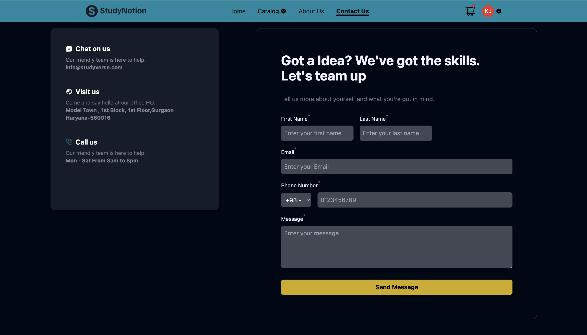
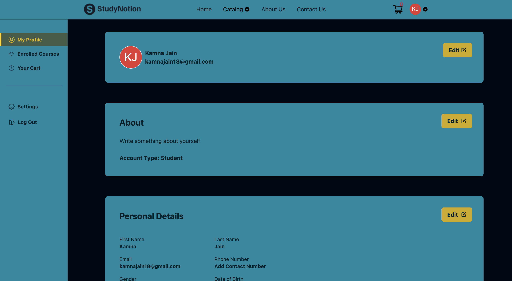

# StudyNotion - Ed-Tech Platform

## Short Description

StudyNotion is a full-stack educational technology (Ed-Tech) platform designed to facilitate online learning. It serves as a Learning Management System (LMS) where users can sign up as students or instructors. Instructors can create and manage courses, while students can browse and enroll in them.

## Key Features

- **User Authentication**: Secure user registration and login system with email verification and password reset functionality.
- **Course Management**: Instructors can create, edit, and publish courses with detailed descriptions, sections, and subsections.
- **Payment Integration**: Seamless payment processing for course enrollment using Razorpay.
- **Student Dashboard**: A personalized dashboard for students to view their enrolled courses and track their progress.
- **Instructor Dashboard**: A dashboard for instructors to manage their courses, view performance metrics, and interact with students.
- **Cloud-Based Media Management**: Utilizes Cloudinary for efficient and scalable video and image hosting.

## Tech Stack

- **Frontend**: React, Redux, Tailwind CSS
- **Backend**: Node.js, Express.js
- **Database**: MongoDB
- **Authentication**: JSON Web Tokens (JWT)
- **File Storage**: Cloudinary
- **Payment Gateway**: Razorpay

## How to Run It Locally

To run the application locally, follow these steps:

1. **Clone the repository:**

   ```bash
   git clone https://github.com/kamnajain06/EdTech-Codegen.git
   cd EdTech-Codegen
   ```

2. **Install frontend dependencies:**

   ```bash
   npm install
   ```

3. **Install backend dependencies:**

   ```bash
   cd server
   npm install
   ```

4. **Set up environment variables:**
   Create a `.env` file in the `server` directory and add the necessary environment variables (e.g., database connection string, JWT secret, Cloudinary and Razorpay API keys).

5. **Start the backend server:**

   ```bash
   npm start
   ```

6. **Start the frontend development server:**
   In the root directory, run:
   ```bash
   npm start
   ```

The application should now be running on `https://edtech-codegen-p5hfkhzmx-kamna-jains-projects.vercel.app/`.

## Live Demo

You can view a live demo of the application [here](https://edtech-codegen-p5hfkhzmx-kamna-jains-projects.vercel.app/).

## Screenshots




